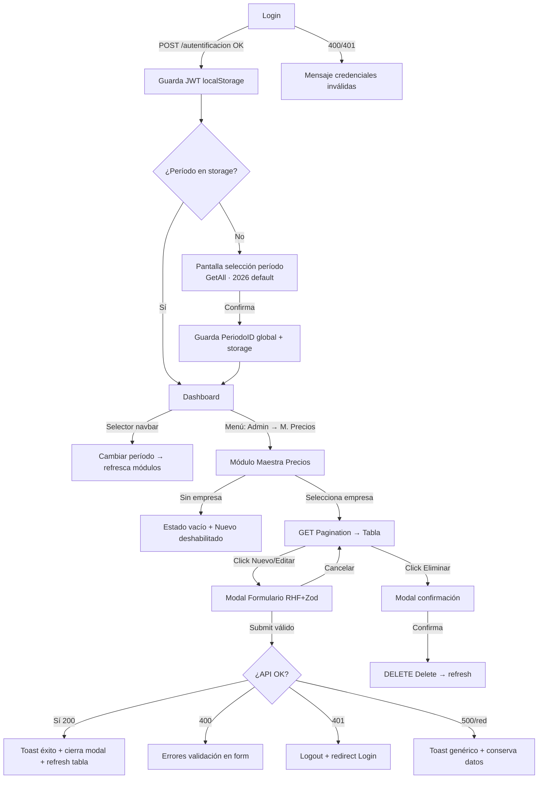

# Especificación Frontend: Mantenimiento de Maestra de Precios Arándanos

> **Proyecto:** App de aprendizaje React web empresarial (hilo conductor del roadmap de Alonso).
> **Tipo:** Frontend SPA que consume la API real de AGROCOM V3 (el backend ya existe).
> **Stack:** Vite + React 19 + TypeScript strict + Tailwind v4 + React Router v7 + TanStack Query v5 + Zustand + React Hook Form + Zod.

## Historia de Usuario Original

> Como usuario del sistema Agro Comercial quiero iniciar sesión en una aplicación web React y, desde el menú de Administración, gestionar la Maestra de Precios de Arándanos (listar, crear, editar y eliminar precios) consumiendo la API real de AGROCOM V3, para administrar los precios por empresa, vía, mercado, consignatario, presentación, calibre, marca y método de cultivo.

## Objetivo

App React funcionando con **login JWT** + **selección de período de operación global** + **CRUD completo** del módulo Maestra de Precios Arándanos (cultivo `BLU`), con combos dependientes por empresa/cultivo. El período elegido se persiste y queda disponible para todos los módulos. Exports e importación masiva quedan **fuera del MVP**.

## Asunciones y Decisiones

| # | Dominio | Asunción/Decisión | Origen |
|---|---------|-------------------|--------|
| 1 | 📱 | Sesión persistente: `token`, `refreshToken`, `expToken` y datos de usuario se guardan en `localStorage`; la sesión sobrevive al refresco. **Sin proxy** — baseURL directo a `http://localhost:5000` (CORS abierto en la API). | 🔄 Refinada (rev. 4) |
| 2 | 📱 | Tras login, la app va a un **dashboard** con menú de navegación **dinámico** construido desde `menus[]` que devuelve el login; el módulo se abre desde **Administración → Maestra de Precios Arándanos**. | 🔄 Refinada (rev. 4) |
| 3 | 📱 | Empresa obligatoria primero: sin empresa seleccionada la tabla está vacía y "Nuevo Precio" deshabilitado. | ✅ Aceptada |
| 4 | 📱 | Listado con **paginación server-side** (`Pagination`, `nroPage`/`numberOfEntries`); búsqueda textual (`textSearch`) también server-side. | ✅ Aceptada |
| 5 | 📱 | Crear/editar abre **modal** con RHF + Zod; combos dependientes (Calibres, Consignatarios, Marcas) filtrados por empresa/cultivo `BLU`; Vías, Mercados y Métodos de Cultivo son globales. | ✅ Aceptada |
| 6 | 📱 | Eliminar = **borrado lógico** (`Delete`) con modal de confirmación previo. | ✅ Aceptada |
| 7 | 📱 | Validación con Zod: todos los campos obligatorios salvo `CalibreID` y `MercadoID` (nullable); `Precio` decimal > 0; valida en cliente antes de enviar. | ✅ Aceptada |
| 8 | 📱 | Feedback con **toasts** de éxito/error; tras guardar OK, cierra modal y refresca tabla. | ✅ Aceptada |
| 9 | 📱 | **Manejo de sesión híbrido (Opción C):** refresh **proactivo** del token usando `expToken` (timestamp Unix) — se renueva con `/actualizar-token` (body `{ token: refreshToken }`, que **rota** el refreshToken) poco antes de expirar mientras hay actividad; modal de cuenta regresiva ante inactividad prolongada; logout si no responde. Errores: `succeeded:false`→mostrar `message`/`errors`; `401`→logout; `500`/red→toast sin perder datos. | 🔄 Refinada (rev. 4) |
| 10 | 📱 | **Selección de período global post-login:** tras autenticarse, si no hay período en storage, se muestra una pantalla/modal para elegir el período de operación (`GetAll` → 2023-2026, **2026 preseleccionado**). Se guarda en `localStorage` y queda como contexto global para todos los módulos. | 🔄 Refinada (rev. 2) |
| 11 | 📱 | **Selector de período en el layout:** el período activo se muestra y es cambiable desde un selector en el navbar (como `cboPeriodoFiltro` del web actual). Cambiarlo actualiza el contexto global y refresca los datos de los módulos dependientes. | ✅ Aceptada (rev. 2) |
| 12 | 📱 | El módulo Maestra de Precios consume el `PeriodoID` del **contexto global** (no se elige dentro del módulo); su filtro combina `EmpresaID` + `PeriodoID` global + `textSearch`. | ✅ Aceptada (rev. 2) |
| 13 | 📱 | **Menú dinámico:** el sidebar se renderiza (recursivo, soporta `idMenuPadre`/`flagHijos`/`visible`/`orden`) desde `menus[]` del login. | ✅ Aceptada (rev. 4) |
| 14 | 📱 | **Permisos (MVP):** el usuario logueado puede todas las operaciones; si una operación falla por permiso server-side (`succeeded:false`), se muestra el `message`. Se deja un punto de extensión para permisos finos. | ✅ Aceptada (rev. 4) |
| 15 | 📱 | **Validación de negocio:** Zod valida formato en cliente; los errores de negocio del backend (incluida **unicidad compuesta**/duplicados, que llegan como `succeeded:false` + `message`) se muestran en el modal sin cerrarlo. | ✅ Aceptada (rev. 4) |
| 16 | 📱 | `idOperador` **no aplica** a este módulo (confirmado: no se usa en filtro ni Insert). | ✅ Aceptada (rev. 4) |

**Parámetros de sesión (configurables):** idle timeout sugerido **25 min** de inactividad antes de avisar; cuenta regresiva **60 s** antes del logout automático. Ajustables en `src/config/session.ts`.

**Períodos:** se obtienen de `GET api/Administracion/PeriodoOperacion/GetAll` (campos `id`, `descripcion`, `fechaInicio`, `fechaFin`). Default sugerido: el período cuyo año es **2026** (o el vigente según fecha actual).

## Flujo de Usuario (BDD)

### Camino feliz — Login
> **DADO que** el usuario no tiene sesión activa
> **CUANDO** ingresa usuario y contraseña válidos y envía el formulario de login
> **ENTONCES** la app llama a `POST /autentificacion`, guarda el JWT en `localStorage` y continúa a la selección de período.

### Camino feliz — Selección de período (post-login)
> **DADO que** el usuario se autenticó y **no hay período guardado** en `localStorage`
> **CUANDO** se carga la app tras el login
> **ENTONCES** se muestra la pantalla/modal de selección de período (`GetAll`, con 2026 preseleccionado); al confirmar, el período se guarda en `localStorage` y como contexto global, y se redirige al dashboard.

> **DADO que** el usuario ya eligió período en una sesión previa (existe en `localStorage`)
> **CUANDO** inicia sesión nuevamente
> **ENTONCES** se salta la selección y entra directo al dashboard usando el período guardado.

> **DADO que** el usuario está dentro de la app
> **CUANDO** cambia el período desde el selector del navbar
> **ENTONCES** se actualiza el contexto global y el storage, y los módulos dependientes refrescan sus datos con el nuevo `PeriodoID`.

### Camino feliz — Listar y filtrar
> **DADO que** el usuario está autenticado y entra a Administración → Maestra de Precios Arándanos
> **CUANDO** selecciona una empresa del combo
> **ENTONCES** la tabla carga los precios paginados de esa empresa (`Pagination`) y habilita el botón "Nuevo Precio".

### Camino feliz — Crear precio
> **DADO que** el usuario tiene una empresa seleccionada
> **CUANDO** hace clic en "Nuevo Precio", completa el modal (vía, mercado, consignatario, presentación, calibre, marca, método cultivo, precio) y guarda
> **ENTONCES** la app valida con Zod, llama a `POST Insert`, muestra toast de éxito, cierra el modal y refresca la tabla.

### Camino feliz — Editar precio
> **DADO que** existe un registro en la tabla
> **CUANDO** el usuario hace clic en "Editar", modifica campos en el modal y guarda
> **ENTONCES** la app llama a `PUT Update`, muestra toast de éxito y refresca la tabla.

### Camino feliz — Eliminar precio
> **DADO que** existe un registro en la tabla
> **CUANDO** el usuario hace clic en "Eliminar" y confirma en el modal
> **ENTONCES** la app llama a `DELETE Delete` (baja lógica), muestra toast y refresca la tabla.

### Caminos alternativos
> **DADO que** el usuario ingresa credenciales inválidas
> **CUANDO** envía el login
> **ENTONCES** la API responde `400/401` y se muestra mensaje de error sin redirigir.

> **DADO que** el usuario está inactivo por el tiempo configurado (25 min)
> **CUANDO** se cumple el idle timeout
> **ENTONCES** aparece un modal con cuenta regresiva (60s); si el usuario interactúa, la sesión continúa y el token se refresca; si no responde, se hace logout automático.

> **DADO que** el token está por expirar y el usuario está activo
> **CUANDO** se detecta actividad cerca del vencimiento
> **ENTONCES** la app refresca el token con `/actualizar-token` de forma transparente (sin interrumpir al usuario).

> **DADO que** el formulario tiene errores de validación
> **CUANDO** el usuario intenta guardar
> **ENTONCES** Zod bloquea el envío y muestra los mensajes por campo; si el error viene del servidor (`400`), se muestran los mensajes del backend sin cerrar el modal.

> **DADO que** no hay empresa seleccionada
> **CUANDO** el usuario entra al módulo
> **ENTONCES** la tabla muestra estado vacío con mensaje "Selecciona una empresa" y "Nuevo Precio" deshabilitado.

## Mockups de la Interfaz

### Login
```
╔══════════════════════════════════════════╗
║            Agro Comercial — Login          ║
╠══════════════════════════════════════════╣
║                                            ║
║   ┌──────────────────────────────────┐    ║
║   │ Usuario:   [____________________] │    ║
║   └──────────────────────────────────┘    ║
║   ┌──────────────────────────────────┐    ║
║   │ Contraseña:[____________________] │    ║
║   └──────────────────────────────────┘    ║
║                                            ║
║   <!-- error: credenciales inválidas -->   ║
║                                            ║
║              [   Ingresar   ]              ║
╚══════════════════════════════════════════╝
```

### Selección de período (post-login, primera vez)
```
╔══════════════════════════════════════════╗
║         Selecciona tu período              ║
╠══════════════════════════════════════════╣
║  ¿Sobre qué período vas a trabajar?        ║
║                                            ║
║   ○ Período 2023                           ║
║   ○ Período 2024                           ║
║   ○ Período 2025                           ║
║   ● Período 2026   (por defecto)           ║
║                                            ║
║              [   Continuar   ]             ║
╚══════════════════════════════════════════╝
```

### Dashboard + Layout con menú (con selector de período global)
```
┌────────────────────────────────────────────────────────────┐
│  AGRO COMERCIAL    Inicio    Período:[2026 ▾]      👤 Alonso │  ← Navbar
├──────────────┬─────────────────────────────────────────────┤
│ ▾ Admin      │                                              │
│   • M. Precios│            Bienvenido, Alonso                │  ← Dashboard
│     Arándanos │                                              │
│   • ...       │      [Tarjetas / accesos / widgets]          │
│              │                                              │
└──────────────┴─────────────────────────────────────────────┘
```

### Módulo Maestra de Precios — Listado
```
╔══════════════════════════════════════════════════════════════╗
║  Maestra de Precios Arándanos                    [+ Nuevo Precio]║
╠══════════════════════════════════════════════════════════════╣
║  Empresa: [Seleccionar...      ▾]   Buscar: [____________] 🔍   ║
╠══════════════════════════════════════════════════════════════╣
║ Vía │ Mercado │ Consign. │ Mét.Cult │ Present │ Calibre │ Marca │ Precio │ ⚙ ║
║─────┼─────────┼──────────┼──────────┼─────────┼─────────┼───────┼────────┼──║
║ Aér │ USA     │ ACME     │ Conv.    │ Clam 6oz│ 12      │ MarcaX│ 18.50  │✏🗑║
║ Mar │ EU      │ FOODSA   │ Orgánico │ Box 1.5k│ 14      │ MarcaY│ 22.00  │✏🗑║
║─────┴─────────┴──────────┴──────────┴─────────┴─────────┴───────┴────────┴──║
║              ◄  Página 1 de 8  ►        [25 ▾] por página      ║
╚══════════════════════════════════════════════════════════════╝
<!-- estado vacío: "Selecciona una empresa para ver los precios" -->
<!-- loading: skeleton de filas -->
```

### Modal Crear / Editar
```
╔════════════════════════════════════════════╗
║  Nuevo Precio                          [X]  ║
╠════════════════════════════════════════════╣
║  Vía:           [Seleccionar...      ▾]     ║
║  Mercado:       [Seleccionar...      ▾]     ║
║  Consignatario: [Seleccionar...      ▾]     ║  ← dependiente de empresa
║  Presentación:  [Seleccionar...      ▾]     ║
║  Calibre:       [Seleccionar...      ▾]     ║  ← dependiente de cultivo
║  Marca:         [Seleccionar...      ▾]     ║  ← dependiente de empresa
║  Método Cultivo:[Seleccionar...      ▾]     ║
║  Precio (USD):  [__________]                ║
║                                              ║
║  <!-- errores Zod por campo -->              ║
║                                              ║
║              [Cancelar]  [Guardar]           ║
╚════════════════════════════════════════════╝
```

### Modal Sesión por expirar
```
╔════════════════════════════════════════════╗
║  ⚠ Tu sesión está por expirar               ║
╠════════════════════════════════════════════╣
║  Por inactividad, tu sesión se cerrará en:   ║
║                                              ║
║                  00:47                       ║
║                                              ║
║         [Cerrar sesión]  [Seguir activo]     ║
╚════════════════════════════════════════════╝
```

## Diagrama de Flujo



## Definición de Componentes

- **`LoginPage`** (Page) — formulario de login, llama al store de auth.
- **`PeriodoSelectPage`** (Page) — selección de período post-login (primera vez); consume `GetAll` y guarda en el store de período.
- **`PeriodoSwitcher`** (Container) — selector de período en el navbar; cambia el contexto global.
- **`RequirePeriodo`** (Utility) — guard que redirige a selección de período si no hay uno activo.
- **`AppLayout`** (Container) — navbar (incluye `PeriodoSwitcher`) + `MenuSidebar` + `<Outlet/>`; envuelve rutas autenticadas.
- **`MenuSidebar`** (Container) — renderiza el menú **dinámico y recursivo** desde `menus[]` del login (respeta `idMenuPadre`, `flagHijos`, `visible`, `orden`).
- **`DashboardPage`** (Page) — página de inicio post-login.
- **`MaestraPreciosPage`** (Page) — ensambla filtro + tabla + modal del módulo.
- **`EmpresaSelect`** (Presentational) — combo de empresa que dispara la carga de datos.
- **`MaestraPreciosTable`** (Container) — tabla paginada server-side con acciones editar/eliminar.
- **`MaestraPrecioFormModal`** (Container) — modal con RHF + Zod para crear/editar; orquesta combos dependientes.
- **`ComboField`** (Presentational) — select reutilizable tipado para los combos.
- **`ConfirmDialog`** (Presentational) — modal de confirmación reutilizable (eliminar).
- **`SessionExpiryModal`** (Container) — modal de cuenta regresiva por inactividad.
- **`ProtectedRoute`** (Utility) — guard de rutas autenticadas (redirige a login si no hay sesión).

## Estructura Propuesta

### Componentes
| Componente | Tipo | Responsabilidad | Props clave |
|------------|------|-----------------|-------------|
| `LoginPage` | Page | Autenticar usuario | — |
| `AppLayout` | Container | Layout autenticado + navegación | `children` |
| `MaestraPreciosPage` | Page | Orquestar módulo | — |
| `MaestraPreciosTable` | Container | Listar paginado + acciones | `empresaId`, `periodoId`, `textSearch` |
| `MaestraPrecioFormModal` | Container | Alta/edición con validación | `open`, `precioId?`, `empresaId`, `onSaved` |
| `ConfirmDialog` | Presentational | Confirmar acciones destructivas | `open`, `message`, `onConfirm` |
| `SessionExpiryModal` | Container | Aviso de expiración | `secondsLeft`, `onStayActive`, `onLogout` |

### Estado y datos
- **Server state (TanStack Query):**
  - `usePreciosPagination(filtro)` → `GET api/MaestraPreciosArandano/Pagination`
  - `usePrecio(id)` → `GET Find`
  - mutations: `Insert` / `Update` / `Delete` (invalidan la query de listado)
  - combos: `GetVias`, `GetMercados`, `GetMetodosCultivo` (globales, `staleTime` alto); `GetCalibres?cultivoID`, `GetConsignatarios`, `GetMarcas` (por cultivo/empresa); `GetPresentations?cropID=BLU` (filtrar por `empresaID` en cliente)
  - períodos: `usePeriodos()` → `GET api/Administracion/PeriodoOperacion/GetAll`
  - empresas: `useEmpresas()` → `GET api/Administracion/Grower/GetAll`
- **Local state:** estado del modal (abierto/cerrado, modo crear/editar), formulario con RHF.
- **Global state (Zustand, persistido en `localStorage`):** `useAuthStore` (`token`, `refreshToken`, `expToken`, `user` {id,name,email,empresa,perfil}, `menus[]`, login/logout/refresh); `usePeriodoStore` (período activo `{ id, descripcion }`, setter — contexto global para todos los módulos); `useUiStore` (toasts) opcional.
- **URL state:** `nroPage`, `numberOfEntries`, `textSearch`, `empresaId` reflejados en query params (deep-link / refresco).

### Rutas
| Ruta | Componente | Permisos |
|------|------------|----------|
| `/login` | `LoginPage` | público |
| `/seleccionar-periodo` | `PeriodoSelectPage` | autenticado (sin período activo) |
| `/` | `DashboardPage` (dentro de `AppLayout`) | autenticado + período activo |
| `/administracion/maestra-precios-arandanos` | `MaestraPreciosPage` | autenticado + período activo |

### Estados de la UI
- **Loading:** skeleton de filas en la tabla; spinner en botones durante mutaciones.
- **Empty:** mensaje "Selecciona una empresa para ver los precios" + acción deshabilitada.
- **Error:** toast (red/500); errores de validación inline en el formulario (400/Zod).
- **Success:** toast de confirmación + cierre de modal + refresh de tabla.

## Contrato de API consumida (referencia — backend ya existe)

| Acción | Método | Ruta | Notas |
|--------|--------|------|-------|
| Login | POST | `/autentificacion` | body `{ userName, password }` → `data.token` |
| Refresh | POST | `/actualizar-token` | refresh token |
| Períodos | GET | `api/Administracion/PeriodoOperacion/GetAll` | campos `id, descripcion, fechaInicio, fechaFin` |
| Empresas | GET | `api/Administracion/Grower/GetAll` | Grower = empresa/productor; alimenta el combo de empresa |
| Listar | GET | `api/MaestraPreciosArandano/Pagination` | query: `nroPage, numberOfEntries, textSearch, PeriodoID, EmpresaID` |
| Buscar 1 | GET | `api/MaestraPreciosArandano/Find?id=` | |
| Crear | POST | `api/MaestraPreciosArandano/Insert` | body = DTO sin Id |
| Actualizar | PUT | `api/MaestraPreciosArandano/Update` | body = DTO con Id |
| Eliminar | DELETE | `api/MaestraPreciosArandano/Delete?id=` | baja lógica |
| Combos | GET | `GetVias`, `GetMercados`, `GetMetodosCultivo`, `GetCalibres?cultivoID=BLU`, `GetConsignatarios`, `GetMarcas` | bajo `api/MaestraPreciosArandano/` |
| Presentaciones | GET | `api/PesosVGM/GetPresentations?cropID=BLU` | devuelve `{ id, presentacionID, presentacion, empresaID }`; **filtrar client-side por `empresaID`** |

**Entidad (DTO):** `ViaID:int`, `MercadoID:string?`, `ConsignatarioID:int`, `PresentacionID:int`, `CalibreID:string?`, `MarcaID:int`, `Precio:decimal`, `MetodoCultivoID:int`, `PeriodoID:int`, `EmpresaID:string`, `EstadoID:int`. Cultivo fijo `BLU`.

> ⚠️ **Riesgo de tipos:** `CalibreID` y `MercadoID` son `string` en el DTO, pero los combos (`GetCalibres`/`GetMercados`) devuelven `{ Id, Nombre }`. Mapear el `Id` del combo a string al enviar. Validar al construir el cliente.

### Wrapper de respuesta (TODA la API)
```ts
interface ApiResponse<T> {
  succeeded: boolean;
  message: string | null;
  errors: { propertyName: string; errorMessage: string }[] | null;
  data: T | null;
}
```

### Login — request / response
```ts
// POST /autentificacion  — password en BASE64
interface AuthRequest { userName: string; password: string; /* base64 */ }

interface AuthResponse {
  id: string; name: string; perfil: number | null; descripcionPerfil: string;
  userName: string; userStatus: string; email: string;
  token: string; refreshToken: string; expToken: number; // Unix ts expiración JWT
  referenciaId: number; empresa: string;
  menus: MenuItem[];
}
interface MenuItem {
  id: number; descripcion: string; icono: string; area: string;
  controlador: string; valoresProcesos: string; accion: string;
  orden: number; flagHijos: boolean; idMenuPadre: number | null; visible: boolean;
}
// POST /actualizar-token  — body { token: <refreshToken> } → devuelve AuthResponse con token/refreshToken/expToken nuevos (rotación)
```

### Paginación
```ts
interface Paginacion<T> {
  cantidadTotal: number; paginaActual: number; totalPaginas: number;
  registrosPorPagina: number; listado: T[];
}
// GET .../Pagination → ApiResponse<Paginacion<MaestraPrecioRow>>
```

### Combos — value / label
| Combo | Endpoint | value | label | Filtro |
|-------|----------|-------|-------|--------|
| Vías | `GetVias` | `Id` | `Nombre` | global |
| Mercados | `GetMercados` | `Id` | `Nombre` | global |
| Métodos Cultivo | `GetMetodosCultivo` | `Id` | `Nombre` | global |
| Calibres | `GetCalibres?cultivoID=BLU` | `Id` | `Nombre` | por cultivo |
| Consignatarios | `GetConsignatarios` | `Id` | `Nombre` | por cultivo/empresa |
| Marcas | `GetMarcas?cultivoID=BLU` | `Id` | `Nombre` | por cultivo |
| Empresas | `Grower/GetAll` | `growerID` | `businessName` | — |
| Presentaciones | `PesosVGM/GetPresentations?cropID=BLU` | `Id` | `Presentacion` | client-side por `empresaID` |

## Plan de Rollback

- **Estrategia:** proyecto de aprendizaje aislado; sin impacto en producción (solo consume API). Rollback = `git revert` del PR.
- **Datos en riesgo:** ninguno en el front. Cuidado: las operaciones CRUD impactan datos **reales** de la BD de AGROCOM si se apunta a un ambiente productivo → **usar siempre ambiente dev/local de la API** durante el aprendizaje.
- **Punto sin retorno:** N/A.

## Criterios de Aceptación

- [ ] El usuario puede iniciar sesión con credenciales válidas (password en Base64) y es redirigido al dashboard.
- [ ] Con credenciales inválidas se muestra el `message`/`errors` del backend y no se redirige.
- [ ] El menú lateral se construye dinámicamente desde `menus[]` del login (jerárquico, respeta `visible`/`orden`).
- [ ] El cliente desempaca `ApiResponse<T>` y maneja `succeeded:false` de forma central.
- [ ] El refresh de token es proactivo (usa `expToken`) y rota el `refreshToken`; el usuario activo no es interrumpido.
- [ ] Un error de negocio (ej. precio duplicado por unicidad compuesta) muestra el `message` del backend sin cerrar el modal.
- [ ] El JWT se guarda en `localStorage` y la sesión persiste al refrescar la página.
- [ ] Tras el primer login (sin período guardado), se muestra la pantalla de selección de período con 2026 preseleccionado.
- [ ] Al confirmar el período, se guarda en `localStorage` (contexto global) y se redirige al dashboard.
- [ ] En sesiones posteriores con período guardado, se entra directo al dashboard sin volver a preguntar.
- [ ] El navbar muestra un selector de período; cambiarlo actualiza el contexto global y refresca los módulos dependientes.
- [ ] El filtro de Maestra de Precios usa el `PeriodoID` del contexto global (combinado con `EmpresaID`).
- [ ] Existe un layout con menú; desde Administración → Maestra de Precios Arándanos se abre el módulo.
- [ ] Las rutas autenticadas redirigen a `/login` si no hay sesión.
- [ ] Sin empresa seleccionada, la tabla muestra estado vacío y "Nuevo Precio" está deshabilitado.
- [ ] Al seleccionar empresa, la tabla carga datos paginados desde `Pagination`.
- [ ] La paginación y la búsqueda textual funcionan contra el servidor.
- [ ] "Nuevo Precio" abre un modal con los campos y combos correspondientes.
- [ ] Los combos Calibres/Consignatarios/Marcas se cargan filtrados por empresa/cultivo `BLU`.
- [ ] La validación Zod bloquea el guardado con datos inválidos y muestra errores por campo.
- [ ] Crear un precio llama a `Insert`, muestra toast y refresca la tabla.
- [ ] Editar un precio carga los datos, llama a `Update` y refresca la tabla.
- [ ] Eliminar pide confirmación, llama a `Delete` (baja lógica) y refresca la tabla.
- [ ] Un error `400` muestra los mensajes del servidor sin cerrar el modal.
- [ ] Un error `401` cierra sesión y redirige al login.
- [ ] El token se refresca automáticamente con `/actualizar-token` mientras el usuario está activo.
- [ ] Tras inactividad (25 min) aparece el modal de cuenta regresiva (60s); "Seguir activo" mantiene la sesión, sin respuesta hace logout.

## Notas para el agente de frontend

- Respetar el roadmap de aprendizaje: este módulo es el hilo conductor de las 8 fases; construir incrementalmente y explicar cada pieza.
- **Una sola forma de hacer cada cosa:** capa `api/` (cliente fetch/axios + funciones por endpoint) → hooks de TanStack Query → componentes. Nunca `fetch` directo en componentes.
- Tipar todo (sin `any`); DTOs en `src/types/`. Toda respuesta es `ApiResponse<T>` → desempacar `data` y chequear `succeeded` en una sola capa.
- **baseURL directo** `http://localhost:5000` (configurable por `.env` `VITE_API_BASE_URL`). CORS abierto en la API → **sin proxy** ni problema de cert. No usar el puerto HTTPS 7214 en dev para evitar el cert self-signed.
- **Login:** enviar `password` en **Base64** (`btoa`). Guardar `token`+`refreshToken`+`expToken`+`user`+`menus`.
- **Refresh proactivo:** programar la renovación usando `expToken` (Unix); `POST /actualizar-token` con `{ token: refreshToken }`, y **reemplazar** token+refreshToken+expToken por los nuevos (rotación).
- **Errores:** capa central que lee `ApiResponse` — si `succeeded:false`, mapear `errors[].propertyName` a campos del form (RHF `setError`) y/o mostrar `message` (ej. duplicado por unicidad compuesta). `401` → logout.
- Tailwind v4 config CSS-first (`@import "tailwindcss";`, sin `tailwind.config.js`).
- Estado de auth en Zustand persistido; interceptor para adjuntar `Authorization: Bearer`.
- ⚠️ Mapear `Id` (number) de los combos Calibre/Mercado a `string` al enviar (el DTO los espera string).
- Permisos finos no expuestos por API → MVP asume permitido y maneja el error server-side. `idOperador` no aplica.
- Exports e importación masiva: **fuera del MVP** (futura iteración).

## Changelog

| Revisión | Fecha (Perú) | Autor | Cambio | Motivo |
|----------|--------------|-------|--------|--------|
| 1 | 2026-06-04 | Alonso Anchante | Spec creada | Definición inicial del proyecto de aprendizaje |
| 2 | 2026-06-04 | Alonso Anchante | Agregada selección de período global post-login + selector en navbar + `usePeriodoStore`; `PeriodoID` pasa de contextual-por-empresa a contexto global persistido | Patrón real del sistema: el período se captura primero y lo consumen todos los módulos (verificado en `Web/.../Layout/Funciones.js`) |
| 3 | 2026-06-04 | Alonso Anchante | Agregados endpoints faltantes: Empresas (`api/Administracion/Grower/GetAll`) y Presentaciones (`api/PesosVGM/GetPresentations?cropID=BLU`, filtrado client-side por empresaID) | Faltaba el origen del combo de empresa y de presentaciones (verificado en `MaestraPreciosArandano/Variables.js` y `app.js`) |
| 4 | 2026-06-04 | Alonso Anchante | Revisión profunda del backend: wrapper `ApiResponse<T>`, login enriquecido (`refreshToken`/`expToken`/`menus[]`), password Base64, paginación `{cantidadTotal,paginaActual,...,listado}`, combos value/label, validación en SP (unicidad compuesta), CORS abierto→sin proxy (baseURL `http://localhost:5000`), menú dinámico desde login, permisos asumidos en MVP, riesgo de tipos Calibre/Mercado, `idOperador` descartado | Última revisión antes del Plan para evitar sorpresas durante el aprendizaje (3 agentes Explore sobre AGROCOM V3) |
